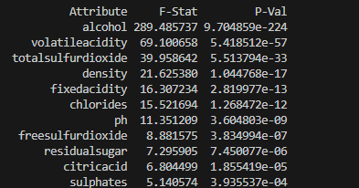

# DataModelingProject

Task 1: Testing citric acid, chlorides, residual sugar, and alcohol against quality

In our hypothesis, we're assuming that quality is the dependent variable. We're also assuming the other features are independent. 
To test the correlation, we ran each "independent" variable against quality in a linear regression to get the slope. We then also 
calculated the correlation coefficient of that line of best fit (r^2). Alcohol and quality had the strongest correlation between
any of the features and the target variable, with a value of 0.413. This indicates a moderate positive correlation. 

Task 2: We now want to find which variables are statistically significant

Our goal is to come up with 3-4 variables that most significantly affect quality. A large F-statistic shows the variation between
variable means, with higher score resulting in the independent variable having a stronger effect on the dependent variable. The 
P-value represent probability of "good luck", so we want this value to be low. For anova, we'll test one variable against target
at one time. After testing, our top 3 most statistically significant variables ended up being alcohol, volatileacidity, and 
totalsulfurdioxide.

